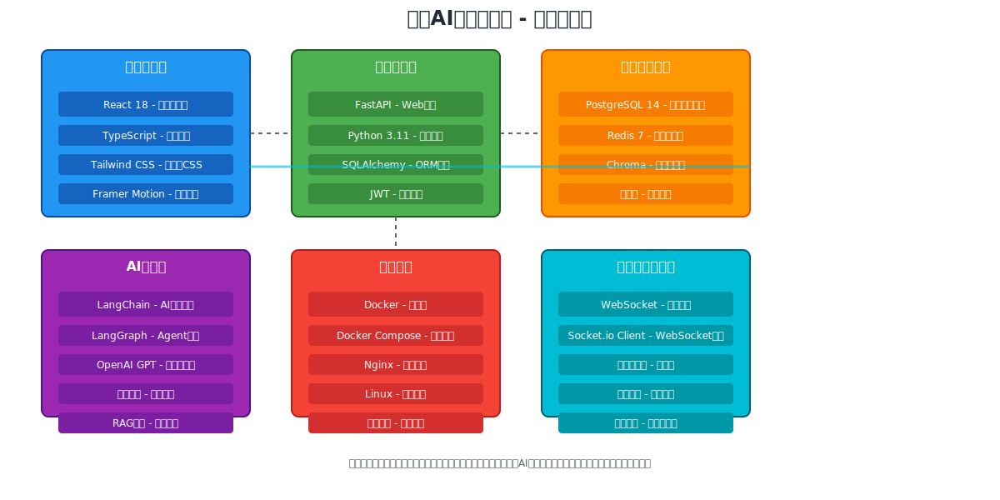
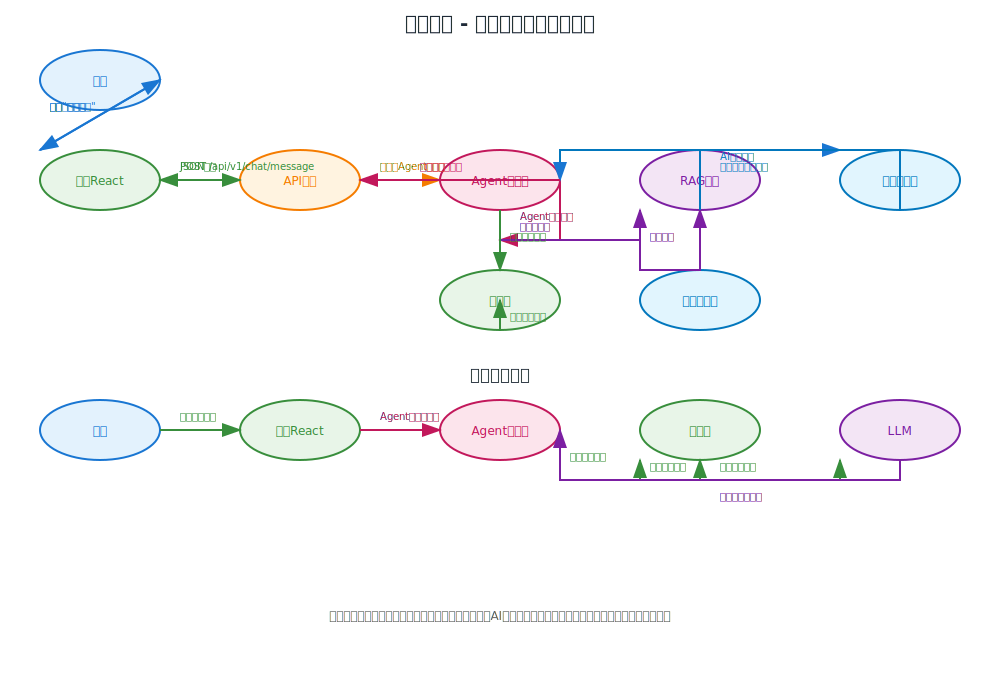
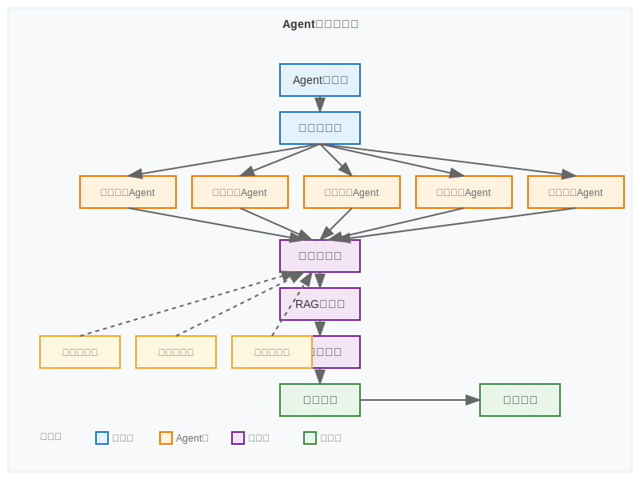

---
AIGC:
    ContentProducer: Minimax Agent AI
    ContentPropagator: Minimax Agent AI
    Label: AIGC
    ProduceID: "00000000000000000000000000000000"
    PropagateID: "00000000000000000000000000000000"
    ReservedCode1: 3045022100eb177a46254d06c412a562cb775632e4442e671124569b21458e2d5dbbd8bdba0220525c1c7dddfc37d7c0ea19240f13553c5828e7b0dfb3850dd86a2f05aa015ce1
    ReservedCode2: 30450221008a69a143c0c83bb53acc7d39f31ac3f3714cb971a0a74ee0288f9c5390b6791702204d875478f4a48712043c3f70bdfff46159d91d7bdf8846aa8593ee9764d581f0
---

# 🏦 银行AI智能体应用

[](https://opensource.org/licenses/MIT)
[](https://reactjs.org/)
[](https://www.typescriptlang.org/)
[](https://www.python.org/)
[](https://fastapi.tiangolo.com/)
[](https://www.docker.com/)

> 🚀 基于AI技术的银行智能体应用，集成多Agent协作、向量数据库检索增强、实时对话交互等功能，为用户提供智能化的银行服务体验。

## 📖 项目简介

本项目是一个完整的企业级银行AI智能体应用，采用现代化技术栈构建，展示了AI Agent在金融领域的创新应用。通过多Agent协作、RAG知识检索、实时对话等先进技术，为用户提供24/7智能银行服务。

### 🎯 项目亮点

- 🤖 **多Agent智能协作系统** - 5个专业Agent协同工作
- 🔍 **RAG知识检索增强** - 基于向量数据库的智能问答
- 💬 **实时智能对话** - WebSocket驱动的流畅体验
- 📊 **数据可视化仪表板** - 直观的金融数据展示
- 🎨 **科技风现代化UI** - 深色主题，流畅动画
- 📱 **全响应式设计** - 完美适配各种设备

## 🏗️ 系统架构

### 整体架构图


本系统采用现代化的微服务架构，包含以下主要层次：

- **用户层**: Web浏览器、移动设备、第三方API
- **负载均衡层**: Nginx反向代理、SSL终端、缓存
- **应用层**: React前端 + FastAPI后端
- **AI服务层**: 多Agent系统 + RAG检索
- **数据层**: PostgreSQL + Redis + Chroma
- **基础设施层**: Docker容器化、监控备份

### 技术架构图



### 数据流图



### Agent系统架构



## 🔧 技术栈详解

### 前端技术栈

| 技术 | 版本 | 用途 | 优势 |
|------|------|------|------|
| **React** | 18.3 | 核心UI框架 | 组件化、虚拟DOM、生态丰富 |
| **TypeScript** | 5.6 | 类型安全 | 编译时错误检查、代码提示 |
| **Tailwind CSS** | 3.4 | 样式框架 | 原子化CSS、快速开发 |
| **Framer Motion** | 12.23 | 动画库 | 高性能动画、声明式API |
| **TanStack Query** | 5.90 | 状态管理 | 数据同步、缓存、错误处理 |
| **React Router** | 6.30 | 路由管理 | 声明式路由、代码分割 |
| **Axios** | 1.13 | HTTP客户端 | 请求拦截、响应拦截 |
| **Socket.io Client** | 4.8 | 实时通信 | WebSocket包装、自动重连 |
| **Recharts** | 2.15 | 数据可视化 | React专用、响应式图表 |
| **React Hook Form** | 7.69 | 表单管理 | 高性能表单、验证 |

### 后端技术栈

| 技术 | 版本 | 用途 | 优势 |
|------|------|------|------|
| **FastAPI** | 0.104 | Web框架 | 自动文档、高性能、异步支持 |
| **Python** | 3.11 | 编程语言 | 简洁语法、丰富生态、AI友好 |
| **SQLAlchemy** | 2.0 | ORM框架 | 强大的ORM、迁移工具 |
| **PostgreSQL** | 14 | 主数据库 | ACID特性、扩展性、JSON支持 |
| **Redis** | 7 | 缓存/会话 | 高速缓存、数据结构存储 |
| **Chroma** | 0.4 | 向量数据库 | 语义搜索、相似度检索 |
| **LangChain** | 0.1 | AI应用框架 | Agent编排、工具调用 |
| **LangGraph** | 0.0 | 状态管理 | 复杂Agent流程管理 |
| **JWT** | - | 身份认证 | 无状态认证、安全令牌 |
| **WebSocket** | - | 实时通信 | 双向通信、低延迟 |

### AI服务技术栈

| 服务 | 提供商 | 功能 | 特性 |
|------|--------|------|------|
| **MiniMax API** | MiniMax | 主语言模型 | 中文优化、金融专业、成本效益 |
| **OpenAI GPT** | OpenAI | 备用模型 | 强大的理解生成能力 |
| **Claude API** | Anthropic | 备用模型 | 安全性高、长文本处理 |
| **Embedding模型** | 多提供商 | 文本向量化 | 语义搜索、知识检索 |
| **向量嵌入** | OpenAI | 语义向量化 | 语义搜索、相似度匹配 |
| **RAG系统** | 自研 | 知识检索增强 | 基于知识库的智能回答 |
| **Agent系统** | LangChain | 智能调度 | 多Agent协作、任务分发 |

### 基础设施技术栈

| 组件 | 版本 | 用途 | 特性 |
|------|------|------|------|
| **Docker** | 24.0 | 容器化 | 环境一致性、快速部署 |
| **Docker Compose** | 2.18 | 编排工具 | 多容器管理、网络隔离 |
| **Nginx** | 1.25 | 反向代理 | 负载均衡、SSL终止、缓存 |
| **PostgreSQL** | 14 | 关系型数据库 | 可靠性、性能、扩展性 |
| **Redis** | 7 | 内存数据库 | 高速缓存、会话存储 |

## 📁 项目结构

```
bank-ai-agent/
├── frontend/                     # React前端应用
│   ├── src/
│   │   ├── components/          # 可复用组件
│   │   │   ├── layout/          # 布局组件
│   │   │   ├── ui/              # UI基础组件
│   │   │   └── charts/          # 图表组件
│   │   ├── pages/               # 页面组件
│   │   │   ├── auth/            # 认证页面
│   │   │   ├── Dashboard.tsx    # 仪表板
│   │   │   ├── Accounts.tsx     # 账户管理
│   │   │   ├── Chat.tsx         # 智能客服
│   │   │   ├── Investments.tsx  # 投资理财
│   │   │   └── Loans.tsx        # 贷款服务
│   │   ├── hooks/               # 自定义Hook
│   │   │   ├── useAuth.ts       # 认证Hook
│   │   │   ├── useWebSocket.ts  # WebSocket Hook
│   │   │   └── useQuery.ts      # 数据查询Hook
│   │   ├── services/            # API服务
│   │   │   ├── api.ts           # HTTP客户端
│   │   │   ├── auth.ts          # 认证服务
│   │   │   ├── chat.ts          # 聊天服务
│   │   │   └── accounts.ts      # 账户服务
│   │   ├── types/               # TypeScript类型
│   │   │   └── index.ts         # 类型定义
│   │   ├── utils/               # 工具函数
│   │   │   ├── helpers.ts       # 通用工具
│   │   │   └── constants.ts     # 常量定义
│   │   ├── styles/              # 样式文件
│   │   │   ├── globals.css      # 全局样式
│   │   │   └── components.css   # 组件样式
│   │   └── App.tsx              # 应用根组件
│   ├── public/                  # 静态资源
│   │   ├── favicon.ico
│   │   └── manifest.json
│   ├── package.json             # 依赖配置
│   ├── vite.config.ts           # Vite配置
│   ├── tailwind.config.js       # Tailwind配置
│   └── tsconfig.json            # TypeScript配置
├── backend/                     # FastAPI后端应用
│   ├── app/
│   │   ├── api/                 # API路由
│   │   │   ├── v1/              # API版本1
│   │   │   │   ├── api.py       # 路由聚合
│   │   │   │   └── endpoints/   # 具体端点
│   │   │   │       ├── auth.py  # 认证端点
│   │   │   │       ├── chat.py  # 聊天端点
│   │   │   │       ├── accounts.py # 账户端点
│   │   │   │       ├── investments.py # 投资端点
│   │   │   │       ├── loans.py # 贷款端点
│   │   │   │       └── agents.py # Agent管理
│   │   │   └── __init__.py
│   │   ├── core/                # 核心配置
│   │   │   ├── config.py        # 应用配置
│   │   │   └── logger.py        # 日志配置
│   │   ├── models/              # 数据模型
│   │   │   ├── user.py          # 用户模型
│   │   │   ├── account.py       # 账户模型
│   │   │   ├── transaction.py   # 交易模型
│   │   │   ├── investment.py    # 投资模型
│   │   │   ├── loan.py          # 贷款模型
│   │   │   └── conversation.py  # 对话模型
│   │   ├── services/            # 业务服务
│   │   │   ├── vector_db.py     # 向量数据库
│   │   │   ├── llm_service.py   # LLM服务
│   │   │   └── agent_coordinator.py # Agent协调器
│   │   ├── agents/              # AI Agent模块
│   │   │   ├── general.py       # 通用客服Agent
│   │   │   ├── account.py       # 账户专员Agent
│   │   │   ├── transfer.py      # 转账专员Agent
│   │   │   ├── investment.py    # 理财专员Agent
│   │   │   ├── loan.py          # 贷款专员Agent
│   │   │   └── base.py          # Agent基类
│   │   ├── database/            # 数据库配置
│   │   │   ├── database.py      # 数据库连接
│   │   │   ├── init_db.py       # 数据库初始化
│   │   │   └── models.py        # 模型基类
│   │   └── utils/               # 工具函数
│   │       ├── auth.py          # 认证工具
│   │       ├── helpers.py       # 通用工具
│   │       └── validators.py    # 数据验证
│   ├── requirements.txt         # Python依赖
│   ├── main.py                  # 应用入口
│   └── alembic.ini             # 数据库迁移配置
├── docs/                        # 项目文档
│   ├── images/                  # 架构图
│   │   ├── system-architecture.svg
│   │   ├── tech-stack.svg
│   │   ├── data-flow.svg
│   │   └── agent-architecture.svg
│   ├── API.md                   # API文档
│   ├── DEPLOYMENT.md            # 部署指南
│   └── DEVELOPMENT.md           # 开发指南
├── scripts/                     # 部署和运维脚本
│   ├── start.sh                # 启动脚本
│   ├── stop.sh                 # 停止脚本
│   ├── deploy.sh               # 部署脚本
│   └── test.sh                 # 测试脚本
├── docker/                      # Docker配置
│   ├── .env.example            # 环境变量模板
│   ├── postgres/               # PostgreSQL配置
│   ├── nginx/                  # Nginx配置
│   └── backend/                # 后端Dockerfile
├── docker-compose.yml           # Docker编排配置
├── docker-compose.prod.yml      # 生产环境配置
├── .gitignore                  # Git忽略文件
├── LICENSE                     # MIT许可证
├── README.md                   # 项目说明
└── PROJECT_SUMMARY.md          # 项目总结
```

## 🚀 快速开始

### 环境要求

| 组件 | 最低版本 | 推荐版本 | 备注 |
|------|----------|----------|------|
| Node.js | 18.0+ | 18.17+ | 前端构建工具 |
| Python | 3.11+ | 3.11.7 | 后端运行时 |
| Docker | 20.10+ | 24.0+ | 容器化部署 |
| Docker Compose | 2.0+ | 2.18+ | 多容器编排 |
| PostgreSQL | 14+ | 14.9 | 主数据库 |
| Redis | 7.0+ | 7.0.11 | 缓存数据库 |

### 开发环境启动

#### 1. 克隆项目
```bash
# 克隆仓库
git clone https://github.com/your-username/bank-ai-agent.git
cd bank-ai-agent

# 检查项目结构
ls -la
```

#### 2. 配置环境变量
```bash
# 复制环境变量模板
cp docker/.env.example .env

# 编辑环境变量（必需配置）
nano .env
```

**必需配置项**：
```bash
# API密钥（选择其中一种配置）
# 方案1：使用MiniMax（推荐，中文优化）
MINIMAX_API_KEY=your_minimax_api_key_here
MINIMAX_GROUP_ID=your_minimax_group_id_here
DEFAULT_LLM_PROVIDER=minimax

# 方案2：使用OpenAI
OPENAI_API_KEY=your_openai_api_key_here
DEFAULT_LLM_PROVIDER=openai

# 方案3：使用Claude
CLAUDE_API_KEY=your_claude_api_key_here
ANTHROPIC_API_KEY=your_anthropic_api_key_here
DEFAULT_LLM_PROVIDER=anthropic

# JWT密钥（生产环境必须修改）
JWT_SECRET_KEY=your_very_secure_jwt_secret_key_here

# 数据库密码（生产环境必须修改）
POSTGRES_PASSWORD=your_secure_database_password
REDIS_PASSWORD=your_secure_redis_password
```

#### 3. 启动开发环境
```bash
# 方式一：使用自动化脚本（推荐）
chmod +x scripts/start.sh
./scripts/start.sh

# 方式二：使用Docker Compose
docker-compose up -d

# 方式三：分别启动前后端
# 后端启动
cd backend
python -m venv venv
source venv/bin/activate  # Windows: venv\Scripts\activate
pip install -r requirements.txt
uvicorn main:app --reload --host 0.0.0.0 --port 8000

# 前端启动
cd frontend
pnpm install
pnpm run dev
```

#### 4. 验证部署
```bash
# 检查服务状态
docker-compose ps

# 运行健康检查
curl http://localhost:8000/health
curl http://localhost:3000

# 查看服务日志
docker-compose logs -f backend
docker-compose logs -f frontend
```

### 访问地址

| 服务 | 地址 | 功能 |
|------|------|------|
| 前端应用 | http://localhost:3000 | React应用界面 |
| 后端API | http://localhost:8000 | RESTful API |
| API文档 | http://localhost:8000/docs | Swagger UI |
| API文档2 | http://localhost:8000/redoc | ReDoc |
| 向量数据库 | http://localhost:8001 | Chroma管理界面 |
| 数据库管理 | localhost:5432 | PostgreSQL |
| 缓存管理 | localhost:6379 | Redis |

### 演示账户

```
用户名: demo_user
密码: demo123
```

> ⚠️ **注意**: 这是演示账户，仅用于功能演示。生产环境中请创建真实的用户账户。

## 🎯 核心业务功能

### 1. 智能客服系统

🤖 **多Agent协作架构**

- **通用客服Agent**: 处理一般性咨询、任务路由、人工转接
- **账户专员Agent**: 专注账户查询、余额管理、交易记录
- **转账专员Agent**: 处理转账操作、安全验证、流程指导
- **理财专员Agent**: 提供投资建议、产品推荐、风险评估
- **贷款专员Agent**: 处理贷款申请、材料指导、进度跟踪
- **安全专员Agent**: 提供安全咨询、风险提示、异常监控

🔍 **RAG知识检索增强**

- **向量数据库**: 使用Chroma存储银行业务知识
- **语义搜索**: 基于语义相似度的智能检索
- **知识增强**: 结合知识库生成准确的专业回答
- **动态更新**: 支持知识库的实时更新和扩展

💬 **实时对话体验**

- **WebSocket通信**: 双向实时通信，低延迟响应
- **多轮对话**: 支持上下文理解和记忆
- **情感分析**: 智能识别用户情感和满意度
- **人工转接**: 复杂问题无缝转接人工客服

### 2. 账户管理

💰 **多账户支持**
- 储蓄账户、支票账户、信用卡账户
- 多币种支持（人民币、美元、欧元等）
- 账户状态实时监控

📊 **余额管理**
- 实时余额查询和显示
- 可用余额计算和展示
- 余额变动趋势分析

📋 **交易记录**
- 详细的资金流水记录
- 交易类型分类和统计
- 交易数据导出功能
- 异常交易提醒

### 3. 转账服务

💸 **智能转账指引**
- AI引导的转账流程指导
- 收款人信息自动识别
- 转账金额合理性检查

🔒 **安全验证**
- 多层次身份验证机制
- 交易密码验证
- 短信验证码确认
- 异常交易风险评估

📈 **转账状态跟踪**
- 实时转账状态更新
- 到账时间预测
- 转账历史记录管理

### 4. 投资理财

📈 **产品展示**
- 丰富的理财产品信息
- 风险等级分类标识
- 收益预期展示
- 产品对比功能

⚖️ **风险评估**
- 用户风险承受能力评估
- 个性化风险匹配算法
- 投资建议生成

💹 **收益分析**
- 投资收益可视化展示
- 收益率计算和分析
- 投资组合优化建议

### 5. 贷款服务

📄 **在线申请**
- AI辅助的贷款申请流程
- 智能表单填写指导
- 申请材料清单生成

✅ **智能审核**
- AI辅助的审核建议
- 风险评估模型
- 审批进度实时跟踪

📋 **产品对比**
- 灵活的贷款产品选择
- 利率对比和计算
- 还款方案设计

## 🔧 开发指南

### 本地开发环境

#### 前端开发
```bash
cd frontend

# 安装依赖
pnpm install

# 启动开发服务器
pnpm run dev

# 代码格式化
pnpm run format

# 类型检查
pnpm run type-check

# 构建生产版本
pnpm run build
```

#### 后端开发
```bash
cd backend

# 创建虚拟环境
python -m venv venv
source venv/bin/activate  # Windows: venv\Scripts\activate

# 安装依赖
pip install -r requirements.txt

# 数据库迁移
alembic upgrade head

# 启动开发服务器
uvicorn main:app --reload --host 0.0.0.0 --port 8000

# 运行测试
pytest

# 代码格式化
black .
isort .
```

### 代码规范

#### 前端代码规范
- **TypeScript**: 启用严格模式，所有类型必须明确定义
- **ESLint**: 遵循React和TypeScript最佳实践
- **Prettier**: 统一的代码格式化
- **组件命名**: 使用PascalCase命名组件
- **文件命名**: 使用kebab-case命名文件

#### 后端代码规范
- **PEP 8**: 遵循Python代码规范
- **Black**: 代码格式化工具
- **isort**: 导入语句排序
- **mypy**: 类型检查工具
- **pytest**: 测试框架

### 测试策略

#### 单元测试
- **前端**: Jest + React Testing Library
- **后端**: pytest + FastAPI TestClient
- **覆盖率**: 保持80%以上的测试覆盖率

#### 集成测试
- **API测试**: 使用FastAPI TestClient测试API端点
- **数据库测试**: 使用测试数据库进行集成测试
- **Agent测试**: 测试多Agent协作功能

#### E2E测试
- **Playwright**: 端到端自动化测试
- **关键流程**: 用户登录、对话交互、业务操作

## 🚀 部署指南

### Docker部署

#### 开发环境
```bash
# 启动所有服务
docker-compose up -d

# 查看服务状态
docker-compose ps

# 查看日志
docker-compose logs -f

# 停止服务
docker-compose down
```

#### 生产环境
```bash
# 构建生产镜像
docker-compose -f docker-compose.yml -f docker-compose.prod.yml build

# 启动生产环境
docker-compose -f docker-compose.yml -f docker-compose.prod.yml up -d

# 监控服务
docker-compose -f docker-compose.yml -f docker-compose.prod.yml logs -f
```

### 手动部署

#### 服务器要求
- **CPU**: 4核心以上
- **内存**: 8GB以上
- **存储**: 50GB以上SSD
- **操作系统**: Ubuntu 20.04+ / CentOS 8+

#### 部署步骤
```bash
# 1. 安装依赖
sudo apt update
sudo apt install docker.io docker-compose nginx

# 2. 配置Nginx
sudo cp docker/nginx/nginx.conf /etc/nginx/nginx.conf
sudo systemctl restart nginx

# 3. 配置SSL证书
sudo apt install certbot python3-certbot-nginx
sudo certbot --nginx -d yourdomain.com

# 4. 部署应用
git clone <repository-url>
cd bank-ai-agent
docker-compose -f docker-compose.yml -f docker-compose.prod.yml up -d

# 5. 配置监控
# 安装监控工具（Prometheus + Grafana）
```

## 📊 性能监控

### 监控指标

#### 应用层指标
- **响应时间**: API端点响应时间
- **吞吐量**: 每秒请求数
- **错误率**: HTTP错误比例
- **并发用户数**: 同时在线用户数

#### 系统层指标
- **CPU使用率**: 各服务CPU占用
- **内存使用率**: 系统和容器内存使用
- **磁盘I/O**: 读写速度和容量
- **网络流量**: 带宽使用情况

#### 业务层指标
- **对话质量**: AI回答准确率
- **用户满意度**: 评分和反馈
- **业务转化**: 功能使用率
- **Agent性能**: 各Agent响应时间

### 监控工具

#### 日志管理
```bash
# 结构化日志记录
docker-compose logs -f backend | jq .

# 日志聚合和分析
# 使用ELK Stack (Elasticsearch + Logstash + Kibana)
```

#### 性能监控
```bash
# 应用性能监控
# 使用Prometheus + Grafana

# 数据库性能监控
# 使用pg_stat_statements扩展

# 缓存性能监控
# Redis监控工具
```

## 🔒 安全考虑

### 认证授权
- **JWT令牌**: 无状态身份认证
- **OAuth2**: 第三方登录支持
- **RBAC**: 基于角色的访问控制
- **会话管理**: 安全的会话处理

### 数据安全
- **数据加密**: 敏感数据加密存储
- **传输加密**: HTTPS/TLS加密传输
- **输入验证**: 严格的输入验证和过滤
- **SQL注入防护**: 参数化查询

### 基础设施安全
- **容器安全**: 最小权限原则
- **网络安全**: 防火墙和网络安全组
- **访问控制**: IP白名单和黑名单
- **审计日志**: 完整的操作审计

## 🤝 贡献指南

### 开发流程
1. **Fork项目**: Fork本项目到你的GitHub账户
2. **创建分支**: `git checkout -b feature/your-feature-name`
3. **提交代码**: 遵循代码规范，添加测试
4. **发起PR**: 创建Pull Request并描述变更
5. **代码审查**: 通过代码审查后合并

### 提交规范
```bash
# 遵循Conventional Commits规范
feat: 添加新功能
fix: 修复bug
docs: 更新文档
style: 代码格式化
refactor: 代码重构
test: 添加测试
chore: 构建过程或辅助工具的变动
```

### Issue报告
- **Bug报告**: 使用Bug模板，详细描述问题和复现步骤
- **功能请求**: 使用Feature模板，描述功能需求和预期效果
- **问题讨论**: 使用Discussion进行技术讨论

## 📈 路线图

### 短期目标（1-3个月）
- [ ] 语音交互功能
- [ ] 图像识别功能
- [ ] 移动端优化
- [ ] 性能优化
- [ ] 单元测试完善

### 中期目标（3-6个月）
- [ ] 多语言支持
- [ ] AI模型定制
- [ ] 区块链集成
- [ ] 开放API
- [ ] 第三方集成

### 长期目标（6-12个月）
- [ ] 微服务架构
- [ ] 云原生部署
- [ ] 实时数据流处理
- [ ] 高级分析功能
- [ ] 商业化部署

## 🔑 MiniMax配置指南

### 为什么选择MiniMax？

MiniMax是本项目的**推荐AI服务提供商**，具有以下优势：

- 🌏 **中文优化**：专为中文语境优化，更好理解银行业务术语
- 💰 **成本效益**：具有竞争力的定价，适合大规模应用
- 🚀 **响应速度**：快速的API响应，提供流畅的用户体验
- 🏦 **金融专业**：具备金融领域知识，理解银行专业术语
- 🔄 **稳定可靠**：国内服务，网络稳定，响应速度快

### 快速配置MiniMax

#### 1. 获取API密钥
1. 访问 [MiniMax官网](https://api.minimax.chat)
2. 注册账户并完成实名认证
3. 创建应用，获取 `API Key` 和 `Group ID`

#### 2. 配置环境变量
在 `backend/.env` 文件中添加：
```bash
MINIMAX_API_KEY=sk-your-minimax-api-key
MINIMAX_GROUP_ID=your-group-id
DEFAULT_LLM_PROVIDER=minimax
```

#### 3. 选择模型
| 模型名称 | 特点 | 适用场景 |
|----------|------|----------|
| `abab6.5s-chat` | 速度优先 | 快速响应、实时对话 |
| `abab6.5g-chat` | 平衡型 | 日常对话、业务咨询 |
| `abab6.5c-chat` | 质量优先 | 复杂分析、详细解答 |

### 高级配置

#### 自定义模型参数
```bash
# 在backend/.env中调整
MAX_TOKENS=2000
TEMPERATURE=0.7
TOP_P=0.9
```

#### 监控和成本控制
- 在MiniMax控制台查看API使用情况
- 设置调用量限制
- 定期检查费用消耗

### 故障排除

**Q: API调用失败？**
A: 检查API Key和Group ID是否正确，账户余额是否充足。

**Q: 响应速度慢？**
A: 尝试使用`abab6.5s-chat`模型，或检查网络连接。

**Q: 中文回复不准确？**
A: MiniMax模型已针对中文优化，如有问题请检查提示词质量。

详细的MiniMax配置指南请查看：[MiniMax配置指南](docs/MINIMAX_CONFIG.md)

## 📞 技术支持

### 常见问题

#### Q: API密钥如何获取？
A: 
- **MiniMax API密钥（推荐）**：访问 https://api.minimax.chat，注册账户后创建应用获取API Key和Group ID
- OpenAI API密钥：访问 https://platform.openai.com/api-keys
- Claude API密钥：访问 https://console.anthropic.com/

#### Q: 数据库连接失败怎么办？
A: 
1. 检查Docker服务是否启动：`docker-compose ps`
2. 检查环境变量配置：`.env`文件
3. 查看日志：`docker-compose logs postgres`

#### Q: 前端构建失败？
A: 
1. 清除依赖：`rm -rf node_modules && pnpm install`
2. 检查Node.js版本：`node --version`（需要18+）
3. 清除缓存：`pnpm store prune`

### 社区支持
- **GitHub Issues**: 提交Bug报告和功能请求
- **Discussions**: 技术讨论和经验分享
- **Wiki**: 详细的开发文档和指南

### 联系方式
- **项目维护者**: MiniMax Agent
- **技术交流**: 通过GitHub Discussions
- **商务合作**: 请通过GitHub Issues联系

## 📄 许可证

本项目采用 [MIT License](LICENSE) 许可证开源。

```
MIT License

Copyright (c) 2024 MiniMax Agent

Permission is hereby granted, free of charge, to any person obtaining a copy
of this software and associated documentation files (the "Software"), to deal
in the Software without restriction, including without limitation the rights
to use, copy, modify, merge, publish, distribute, sublicense, and/or sell
copies of the Software, and to permit persons to whom the Software is
furnished to do so, subject to the following conditions:

The above copyright notice and this permission notice shall be included in all
copies or substantial portions of the Software.

THE SOFTWARE IS PROVIDED "AS IS", WITHOUT WARRANTY OF ANY KIND, EXPRESS OR
IMPLIED, INCLUDING BUT NOT LIMITED TO THE WARRANTIES OF MERCHANTABILITY,
FITNESS FOR A PARTICULAR PURPOSE AND NONINFRINGEMENT. IN NO EVENT SHALL THE
AUTHORS OR COPYRIGHT HOLDERS BE LIABLE FOR ANY CLAIM, DAMAGES OR OTHER
LIABILITY, WHETHER IN AN ACTION OF CONTRACT, TORT OR OTHERWISE, ARISING FROM,
OUT OF OR IN CONNECTION WITH THE SOFTWARE OR THE USE OR OTHER DEALINGS IN THE
SOFTWARE.
```

## ⚠️ 免责声明

本项目仅供学习和演示使用。在生产环境中使用涉及金融服务的功能时，需要：

1. **合规审查**: 符合当地金融法规要求
2. **安全加固**: 加强安全措施和防护
3. **法律咨询**: 咨询专业法律意见
4. **测试验证**: 充分测试和验证功能

开发者和贡献者不对使用本项目造成的任何损失承担责任。

---

## 🎉 结语

感谢您对银行AI智能体项目的关注！这个项目展示了AI技术在金融服务领域的创新应用，通过现代化的技术栈和先进的设计理念，为用户提供了卓越的智能银行服务体验。

我们期待您的反馈、建议和贡献。让我们一起推动AI在金融领域的创新发展！

**⭐ 如果这个项目对您有帮助，请给我们一个Star！**

---

*最后更新：2024年12月*